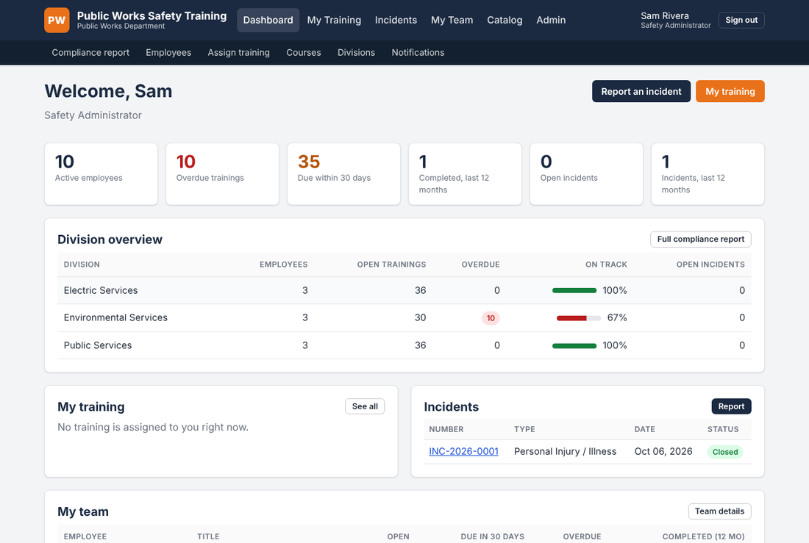

# Public Works Safety Training

An annual OSHA safety training and incident management platform for a municipal Public Works Department with an **Electric Services** division, an **Environmental Services** division and a **Public Services** division.

**Developed by Lorenzo McCoy and Mark Tompkins.**

## Open it

There are two editions of the platform in this repository.

| | Browser edition | Full platform |
| --- | --- | --- |
| Where it runs | GitHub Pages, nothing to install | A small server (or a free GitHub Codespace for a trial) |
| Address | **https://tompkins52.github.io/Safety-Training/** | Your own address once it is hosted |
| Training modules and 10-question quizzes | Yes | Yes |
| Certificates | Yes | Yes |
| Incident reports, investigation, printable report | Yes (saved in the browser; export to JSON to hand in) | Yes (central records) |
| Email reminders 30 days before due, 7 days, overdue | Calendar reminders (.ics download) | Yes, automatic |
| Supervisor completion and incident notices | "Email my record" and "Email this report" buttons | Yes, automatic |
| Employee accounts, assignments by division, compliance reports | No | Yes |

**Browser edition.** Open https://tompkins52.github.io/Safety-Training/ on any phone or computer. First-time setup for the repository owner: Settings > Pages > Source "Deploy from a branch" > branch `gh-pages`, folder `/ (root)` > Save. The site is rebuilt automatically whenever course content changes on `main`.

**Full platform, try it in five minutes.** Open the repository on GitHub, click **Code > Codespaces > Create codespace on main**, wait for the setup to finish, and the platform opens in a new browser tab with demo accounts loaded (see below). Codespaces is free for personal GitHub accounts within the monthly allowance.

**Full platform, hosted for the department.** Any of these works:
- [Deploy to Render](https://render.com/deploy?repo=https://github.com/Tompkins52/Safety-Training) using the included `render.yaml` (Starter plan with a persistent disk, about $8 per month; the file explains the free option).
- Docker on a city server: `docker compose up -d` (below).
- IT-managed Linux or Windows server: [docs/deployment.md](docs/deployment.md).



## What it does

**Annual training**

- Twelve training modules: one for each of OSHA's Top 10 most frequently cited standards, plus **Pole Top Rescue** and **Bucket Truck (Aerial Lift) Rescue** for the Electric Services and Public Services divisions. Each module is written for public works crews, with division-specific examples.
- A **10-question quiz** at the end of every module. 80% passes (configurable), retakes are allowed, every attempt is recorded, and a printable certificate is issued on completion.
- Training is assigned by division. When an employee passes, next year's assignment is created automatically, due 12 months after completion, so the cycle is truly annual.
- A course catalog that shows the current OSHA Top 10 list (preliminary FY 2026 and final FY 2025 are included) and which module covers each standard. The list lives in one data file and is updated once a year.

**Email notifications**

- Employees are emailed **30 days before** training is due, again at **7 days**, and every 7 days once it is overdue.
- **Direct supervisors are emailed** each time one of their employees completes a module, with the score and date.
- Safety administrators and the reporter's supervisor are emailed when an incident is reported, and the reporter and supervisor are emailed when it is closed.
- A daily scheduler runs inside the app, or the same job can be run from cron. Every message is kept in a notification log; when no mail server is configured the messages are logged instead of sent, so the platform works out of the box.

**Incident management**

- Report **personal injury**, **property damage** and **vehicle** incidents (including near misses) with type-specific fields: body part, treatment, days away or restricted and OSHA recordability for injuries; property owner and estimated cost for property damage; unit number, driver, police report, drug and alcohol testing, seat belt use and preventability for vehicle incidents.
- An investigation workflow that records the **direct cause**, the **root cause**, the **contributing factor type** (behavioral, engineered or environmental), lessons learned, and **corrective actions** with an owner, a target date and status tracking. An incident cannot be closed until the causes and factor type are recorded.
- A **printable incident report** (print to paper or PDF from the browser) with signature lines.
- Access control: employees see the incidents they reported, supervisors see their division and their team, safety administrators see everything.

**Administration and reporting**

- Employee accounts with division, direct supervisor and role (employee, supervisor, safety administrator). Temporary passwords are generated and must be changed at first login.
- A compliance matrix of every employee and every course, an overdue list, per-division statistics on the dashboard, and a CSV export.
- Bulk assignment by division and course, a "new hire" flow that assigns everything at once, and course settings (which divisions each module applies to, renewal interval, active or inactive).

## Quick start

Requires Python 3.10 or newer.

```bash
git clone https://github.com/Tompkins52/Safety-Training.git
cd Safety-Training
python -m venv .venv
source .venv/bin/activate          # Windows: .venv\Scripts\activate
pip install -r requirements.txt
cp .env.example .env               # edit at least SECRET_KEY and ORG_NAME
export FLASK_APP=run.py            # Windows: set FLASK_APP=run.py

flask init-db                      # creates the database and loads the 12 modules
flask seed-demo                    # optional: demo divisions, employees and assignments
python run.py                      # http://localhost:5000
```

Demo accounts (all with password `Welcome123!`):

| Role | Email |
| --- | --- |
| Safety administrator | safety.admin@example.gov |
| Supervisors | electric.super@example.gov, environmental.super@example.gov, public.super@example.gov |
| Employees | j.carter@example.gov (Electric), r.patel@example.gov (Environmental), d.kowalski@example.gov (Public), and others |

For a real deployment skip `seed-demo` and create the first administrator with `flask create-admin`, then add employees under **Admin > Employees**. See [docs/deployment.md](docs/deployment.md) and [docs/admin-guide.md](docs/admin-guide.md).

### Docker

```bash
cp .env.example .env   # edit it
docker compose up -d --build
```

The app listens on port 8000. The SQLite database is kept in `./instance` and the course content in `./content`, both mounted from the host.

## Training modules

| # | Module | Standard | Divisions |
| --- | --- | --- | --- |
| 1 | Fall Protection: General Requirements | 29 CFR 1926.501 | All |
| 2 | Hazard Communication (HazCom) | 29 CFR 1910.1200 | All |
| 3 | Control of Hazardous Energy (Lockout/Tagout) | 29 CFR 1910.147 | All |
| 4 | Scaffolding | 29 CFR 1926.451 | All |
| 5 | Ladders | 29 CFR 1926.1053 | All |
| 6 | Respiratory Protection | 29 CFR 1910.134 | All |
| 7 | Powered Industrial Trucks (Forklifts) | 29 CFR 1910.178 | All |
| 8 | Fall Protection: Training Requirements | 29 CFR 1926.503 | All |
| 9 | Eye and Face Protection | 29 CFR 1926.102 | All |
| 10 | Machine Guarding | 29 CFR 1910.212 | All |
| | Pole Top Rescue | 29 CFR 1910.269 | Electric Services, Public Services |
| | Bucket Truck (Aerial Lift) Rescue | 29 CFR 1910.269, 1910.67 | Electric Services, Public Services |

Ranks 1 to 10 follow OSHA's preliminary FY 2026 list (October 1, 2025 to August 31, 2026). Division mapping can be changed by an administrator under **Admin > Courses**.

Each module is a JSON file in `content/courses/` with learning objectives, six to eight content sections, key takeaways and its ten quiz questions with explanations. Edit the files and reload them from **Admin > Courses** or with `flask load-content`. See [docs/content-authoring.md](docs/content-authoring.md).

The training content is an awareness-level annual refresher. It summarizes the standards and does not replace the text of the regulations, the department's written programs, or the hands-on drills those programs require (for example timed pole top and bucket truck rescue drills).

## Project layout

```
site/            browser edition (index.html, app.js, extra.css); built by scripts/build_site.py
scripts/         build_site.py writes the browser edition to dist/
app/
  blueprints/      auth, dashboard and team pages, training and quizzes, incidents, admin
  services/        assignments and grading, notifications, mailer, content loader
  templates/       Jinja pages, printable report and certificate, email templates
  static/          stylesheet and a small script
  models.py        SQLAlchemy models
  scheduler.py     daily reminder job (APScheduler)
  cli.py           flask commands
content/
  courses/*.json   the 12 training modules and quizzes
  osha_top10.json  OSHA Top 10 lists by fiscal year
docs/              deployment, administration, content authoring, updating the Top 10
tests/             end-to-end tests (pytest)
```

## Commands

| Command | Purpose |
| --- | --- |
| `flask init-db` | Create tables, default divisions and load course content (safe to re-run) |
| `flask load-content` | Reload modules and quizzes from `content/courses/` |
| `flask create-admin` | Create a safety administrator account |
| `flask seed-demo` | Load demo divisions, people and assignments |
| `flask assign-annual --due 2027-01-31` | Assign every applicable course to every active employee |
| `flask run-notifications` | Run the daily reminder job once (for cron) |
| `flask send-test-email you@example.gov` | Check the SMTP settings |
| `python scripts/build_site.py` | Build the browser edition into `dist/` |
| `python -m pytest tests` | Run the test suite |

## License

MIT. See [LICENSE](LICENSE).
